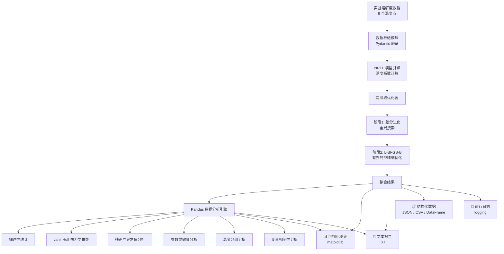

# 🧪 壬二酸 NRTL 模型参数拟合与数据分析系统

> **Azelaic Acid / Water — NRTL Thermodynamic Parameter Regression & Data Analysis Engine**
>
> 基于固-液平衡理论与全局优化算法，精准拟合壬二酸在水中溶解度的 NRTL 模型交互参数；同时利用 Pandas 进行多维度数据分析（描述性统计、热力学量推导、灵敏度分析、异常值检测），为化工过程设计提供可靠的热力学基础数据与深度洞察。

---

## 🏗️ 系统架构



### 核心模块职责

| 模块 | 路径 | 职责 |
|------|------|------|
| **数据管理** | `src/data/` | 实验数据加载、Pydantic 校验、热力学常数管理、Pandas DataFrame 转换 |
| **NRTL 模型** | `src/models/` | 活度系数计算、固-液平衡求解、迭代收敛控制 |
| **参数拟合** | `src/fitting/` | 差分进化 + L-BFGS-B 两阶段有界优化 |
| **数据分析** | `src/analysis/` | Pandas 描述性统计、van't Hoff 热力学推导、残差/异常值分析、参数灵敏度、温度分组、相关性矩阵 |
| **可视化** | `src/visualization/` | 溶解度对比图、偏差图、van't Hoff 图、仪表板、相关性热力图、灵敏度图、残差分布图 |
| **报告生成** | `src/report/` | TXT / JSON / CSV 多格式报告输出 + 数据分析摘要 |
| **日志系统** | `src/utils/` | 结构化日志，控制台 + 文件双通道 |

---

## 🛠 技术栈

- **Runtime**: Python 3.11
- **科学计算**: NumPy 1.26, SciPy 1.13
- **数据分析**: Pandas 2.2
- **可视化**: Matplotlib 3.9
- **数据校验**: Pydantic 2.9
- **容器化**: Docker + Docker Compose
- **优化算法**: 差分进化 (DE) + L-BFGS-B 有界局部优化

---

## 🚀 快速启动 (Docker)

1. 确保 Docker Desktop 已运行。
2. 在根目录执行：
   ```bash
   docker compose up --build
   ```
3. 程序将自动完成参数拟合，结果直接输出到项目根目录的 `output/` 文件夹中。
4. 查看运行日志：
   ```bash
   docker compose logs nrtl-fitting
   ```
5. 查看拟合结果：
   - 文本报告：`output/fitting_report.txt`
   - 分析摘要：`output/analysis_summary.txt`
   - JSON 数据：`output/fitting_result.json`
   - 分析 JSON：`output/analysis_report.json`
   - CSV 数据：`output/fitting_data.csv`
   - 主数据表：`output/analysis_master_data.csv`
   - 可视化图表：`output/figures/` 目录下

---

## 🧪 运行测试

使用 Docker Compose 的 `test` profile 一键运行全部测试用例，无需本地安装任何依赖：

```bash
docker compose --profile test run --rm nrtl-test
```

测试覆盖范围：

| 测试模块 | 文件 | 验证内容 |
|----------|------|----------|
| **数据校验** | `tests/test_solubility_data.py` | 9 个数据点加载、Pydantic 校验、温度/摩尔分数范围 |
| **NRTL 模型** | `tests/test_nrtl_model.py` | τ(T) 计算、G 参数、活度系数、溶解度求解 |
| **参数优化** | `tests/test_optimizer.py` | 两阶段拟合、AARD<15%、R²>0.8、参数物理合理性 |
| **数据分析** | `tests/test_analysis.py` | DataFrame 构建、描述性统计、van't Hoff 回归、残差分析、异常检测、灵敏度、分组分析、相关性、导出 |
| **报告输出** | `tests/test_report.py` | TXT/JSON/CSV 生成、4+4 种图表输出完整性 |

---

## 📂 项目结构

```
label-3734/
├── README.md                    # 项目文档
├── Dockerfile                   # 容器镜像定义
├── docker-compose.yml           # 容器编排配置
├── requirements.txt             # Python 依赖清单
├── tests/
│   ├── test_solubility_data.py  # 数据加载与校验测试
│   ├── test_nrtl_model.py       # NRTL 模型计算测试
│   ├── test_optimizer.py        # 参数拟合优化器测试
│   ├── test_analysis.py         # 数据分析模块测试
│   └── test_report.py           # 报告与图表生成测试
├── src/
│   ├── main.py                  # 主入口 — 全流程编排
│   ├── data/
│   │   └── solubility.py        # 实验数据管理与校验 + DataFrame
│   ├── models/
│   │   └── nrtl.py              # NRTL 活度系数模型
│   ├── fitting/
│   │   └── optimizer.py         # 两阶段参数优化器
│   ├── analysis/
│   │   └── analyzer.py          # Pandas 数据分析引擎
│   ├── visualization/
│   │   └── plotter.py           # 结果可视化 (8 种图表)
│   ├── report/
│   │   └── generator.py         # 报告生成 (TXT/JSON/CSV) + 分析摘要
│   └── utils/
│       └── logger.py            # 结构化日志系统
└── output/                      # 运行产出目录
    ├── fitting_report.txt       # 详细文本报告
    ├── analysis_summary.txt     # 数据分析摘要报告
    ├── fitting_result.json      # 结构化 JSON 数据
    ├── analysis_report.json     # 数据分析 JSON 报告
    ├── fitting_data.csv         # 对比数据表 (Pandas 输出)
    ├── analysis_master_data.csv # 主数据表 (Pandas DataFrame)
    ├── figures/
    │   ├── solubility_comparison.png  # 溶解度拟合对比图
    │   ├── relative_deviation.png     # 相对偏差分布图
    │   ├── vant_hoff_plot.png         # van't Hoff 图
    │   ├── fitting_dashboard.png      # 拟合综合仪表板
    │   ├── correlation_heatmap.png    # 变量相关性热力图
    │   ├── parameter_sensitivity.png  # 参数灵敏度分析图
    │   ├── residual_distribution.png  # 残差分布与 Q-Q 图
    │   └── analysis_dashboard.png     # 数据分析综合仪表板
    └── logs/
        └── nrtl_fitting.log     # 运行日志
```

---

## 🔬 核心业务逻辑

### 实现路径

1. **数据接入** → 加载 9 个温度-溶解度实验数据点，Pydantic 严格校验
2. **模型构建** → 实现 NRTL 活度系数方程 + 固-液平衡迭代求解
3. **参数优化** → 差分进化全局搜索 → L-BFGS-B 有界局部精调
4. **结果分析** → 计算 RMSD、AARD、R² 等拟合质量指标
5. **数据分析** → Pandas 描述性统计 + 热力学推导 + 灵敏度 + 异常检测
6. **产出交付** → 自动生成图表 + 多格式报告 + 分析摘要

### 核心功能点

- **NRTL 活度系数精确计算** — 完整实现二元体系 NRTL 方程，含数值稳定性保护
- **全局-局部两阶段优化** — 差分进化避免陷入局部最优，L-BFGS-B 有界局部精调
- **固-液平衡求解** — 无限稀释近似 + 迭代精修确保收敛
- **多维度拟合质量评价** — RMSD / AARD / R² / 逐点相对偏差
- **Pandas 数据分析引擎** — 描述性统计、van't Hoff 热力学量推导 (ΔH/ΔS/ΔG)、Z-score 异常值检测、参数灵敏度分析、温度区间分组统计、Pearson 相关性矩阵
- **专业级可视化仪表板** — 溶解度对比、偏差分布、van't Hoff 图、相关性热力图、灵敏度曲线、残差分布 Q-Q 图

### 已知参数

| 参数 | 符号 | 值 | 单位 |
|------|------|-----|------|
| 熔点 | T_m | 379.65 | K |
| 熔化焓 | ΔH_fus | 34500 | J/mol |
| 气体常数 | R | 8.314 | J/(mol·K) |
| 非随机性参数 | α | 0.3 | — |

### 实验数据

| 温度 (K) | 摩尔分数 x |
|----------|-----------|
| 283.15 | 7.140×10⁻⁵ |
| 288.15 | 9.189×10⁻⁵ |
| 293.15 | 1.476×10⁻⁴ |
| 298.15 | 1.703×10⁻⁴ |
| 303.15 | 2.186×10⁻⁴ |
| 308.15 | 2.891×10⁻⁴ |
| 313.15 | 3.502×10⁻⁴ |
| 318.15 | 4.974×10⁻⁴ |
| 323.15 | 9.849×10⁻⁴ |

---

## 🔧 专业工程实践

### 1. 日志系统
- 使用 Python 标准 `logging` 库，禁止 `print()`
- 控制台 + 文件双通道输出，结构化格式：`时间 | 级别 | 模块 | 消息`
- 通过 `docker compose logs` 可直接查看清晰的运行日志

### 2. 错误处理
- 数值计算异常保护（分母趋零、NaN/Inf 检测）
- 迭代不收敛预警机制
- 全局异常捕获，返回明确错误信息

### 3. 数据校验
- Pydantic 模型验证温度范围 (200-500 K)、摩尔分数 (0, 1)
- 热力学常数合理性校验
- 数据点数量最低要求检查

### 4. 接口设计
- 模块职责清晰，通过数据类 (dataclass) 传递结构化结果
- `FittingResult` 封装全部拟合产出，支持 `.summary()` 自描述
- 优化器参数完全可配置（搜索范围、收敛容差、种群大小等）

### 5. 生产级特性清单

| 维度 | 状态 | 说明 |
|------|------|------|
| 模块化 | ✅ | 6 个独立模块，职责明确 |
| 数据校验 | ✅ | Pydantic + 自定义验证器 |
| 日志系统 | ✅ | 结构化双通道输出 |
| 错误处理 | ✅ | 数值保护 + 全局兜底 |
| 容器化 | ✅ | Docker 一键运行 |
| 数据持久化 | ✅ | Docker Volume 持久存储 |
| 可复现性 | ✅ | 固定随机种子 + 锁定依赖版本 |
| 多格式输出 | ✅ | TXT / JSON / CSV / PNG |
| 可扩展性 | ✅ | 支持替换数据集 / 调整模型参数 |

---

## � 服务说明

本项目为**纯后端批处理程序**（非 HTTP 服务），运行后自动完成计算并退出，无端口映射、无数据库、无前端界面。

- **运行方式**: `docker compose up --build` → 自动计算 → 输出到 `output/` → 容器退出
- **测试方式**: `docker compose --profile test run --rm nrtl-test`

---

## �🐳 Docker 镜像源配置

### 推荐配置（已内置）

```yaml
# docker-compose.yml
services:
  nrtl-fitting:
    build: .
    # Dockerfile 使用 python:3.11-slim
```

### pip 依赖源
已在 Dockerfile 中配置阿里云镜像加速：
```dockerfile
RUN pip config set global.index-url https://mirrors.aliyun.com/pypi/simple/
```

---

## 📷 输出示例

运行完成后将生成以下产出：

### 拟合图表
- **溶解度拟合对比图** — 实验数据点 vs NRTL 模型计算曲线
- **相对偏差分布图** — 各温度点的拟合偏差百分比
- **van't Hoff 图** — ln(x) vs 1000/T 线性化分析
- **拟合综合仪表板** — 2×2 子图 + 参数摘要

### 数据分析图表
- **相关性热力图** — 核心变量 Pearson 相关系数矩阵
- **参数灵敏度图** — Δg₁₂/Δg₂₁ 扰动对 AARD 的影响曲线
- **残差分布图** — 残差直方图 + 正态拟合 + Q-Q 图
- **分析综合仪表板** — van't Hoff 回归、温度分组箱线图、灵敏度对比、分析摘要

### 报告文件
- **详细文本报告** — 包含逐点对比、活度系数、模型方程说明
- **数据分析摘要** — 热力学推导、残差统计、异常值检测、分组分析
- **JSON 结构化数据** — 拟合结果 + 分析报告，支持程序化读取
- **CSV 数据表** — Pandas DataFrame 导出，便于导入 Excel 或其他工具
